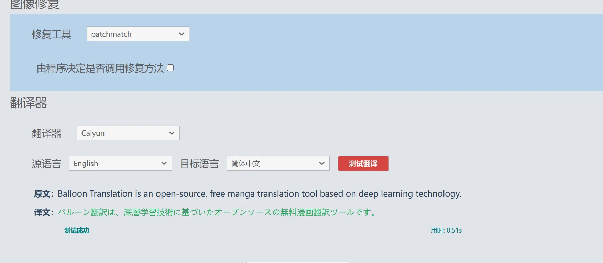
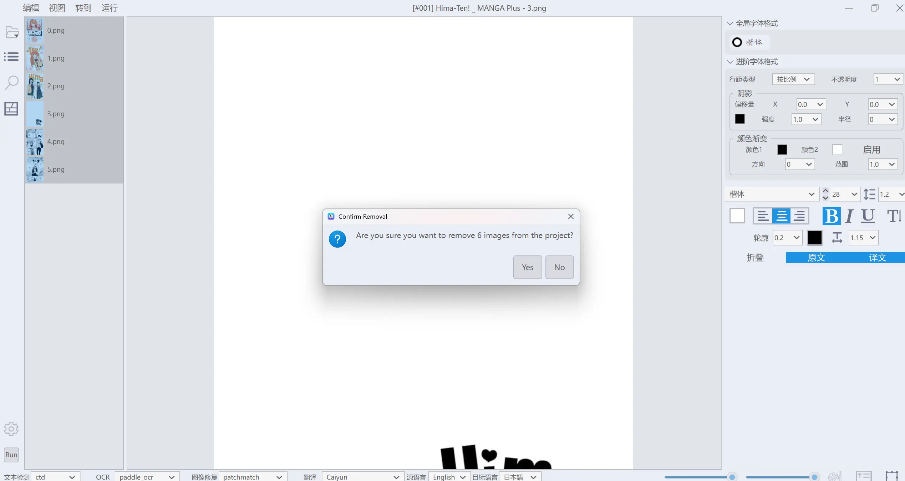
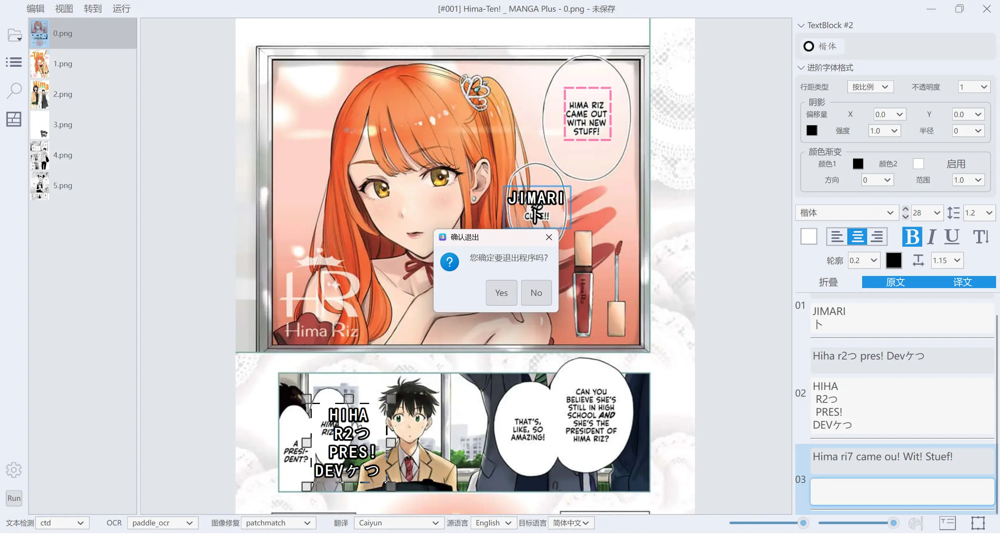

# BallonTranslator-ai

> [!IMPORTANT]
> **叠甲。本人并不会Python.该项目是对 [BallonsTranslator](https://github.com/dmMaze/BallonsTranslator) 的个人定制化,全程使用Augment进行二次开发,请谨慎使用!!!**

---
## 更新说明 (2024-04-15/16)

* 界面优化
  - 添加双击顶部栏缩放窗口功能
  - ~~将全局字体格式和进阶字体格式修改为tabs切换形式~~
  - 添加关闭程序时的确认提示

* 图片导入功能增强
  - 支持拖拽文件/文件夹、选择文件(多选)和选择文件夹等多种方式

* 工作区图片管理
  - 新增删除工作区图片的功能，支持按住ctrl多选后右键删除
  - 新增多选图片后右键翻译所选图片的功能(有bug)

* 翻译功能增强
  - 新增测试翻译源是否可用的功能

* 国际化适配
  - 根据系统当前支持的语言进行界面适配(有待完善...)
* 修复
  - **LLM_API_translator** 翻译器proxy格式不对导致软件不能正常翻译且无法修改proxy
  - paddleocr已经安装无法使用与opencv依赖冲突问题
  - 其他在使用软件时遇到的问题...


**翻译源测试**
<p></p>

**删除图片**
<p></p>

**退出提示**
<p></p>

**推拽**
<p></p>

关于后续:
可能会新增一些更加方便的功能,但不会有核心功能的修改(关键我也不会哈哈哈)
完全取决与ai的水平

**最后个人使用的一点小经验:**

0. 翻译的质量取决译ocr的质量(原文和ocr牛马不对AI难救)
1. 日文ocr: mit48/manga-orc/paddleocr
2. 英文ocr: paddleocr/google的三种ocr(不稳定/耗时久但精准度最高)
3. 字体格式尽量提前调好,程序自动设置的效果并不好
---

# Features
* 一键机翻
  - 译文回填参考对原文排版的估计，包括颜色，轮廓，角度，朝向，对齐方式等
  - 最后效果取决于文本检测，识别，抹字，机翻四个模块的整体表现
  - 支持日漫和美漫
  - 英译中，日译英排版已优化，文本布局以提取到的背景泡为参考，中文基于 pkuseg 进行断句，日译中竖排待改善

* 图像编辑
  支持掩膜编辑和修复画笔

* 文本编辑
  - 支持所见即所得地富文本编辑和一些基础排版格式调整、[字体样式预设](https://github.com/dmMaze/BallonsTranslator/pull/311)
  - 支持全文/原文/译文查找替换
  - 支持导入导出 word 文档

* 适用于条漫

## 运行源码

安装 [Python](https://www.python.org/downloads/release/python-31011) **< 3.12** (别用微软应用商店版) 和 [Git](https://git-scm.com/downloads)

```bash
# 克隆仓库
$ git clone https://github.com/Alioth996/BallonsTranslator-ai.git; cd BallonsTranslator-ai

# 启动程序
$ python3 launch.py
or 双击BallonsTranslator.bat
# 更新程序
python3 launch.py --update
```

## 详细的文档
- 原作者项目使用文档: https://github.com/dmMaze/BallonsTranslator


